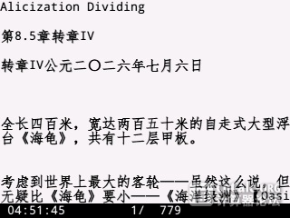
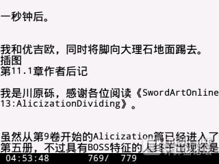
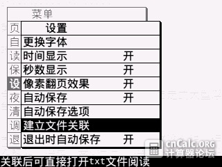
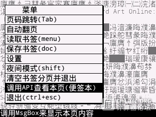

nNovel Plus
===========

nNovel Plus is a simple e-book reader which can be run on TI-Nspire calculator(ndless 3.1 or higher required).The program is able to encode text file with Chinese characters(GBK only) and support all nspire series including clickpad model, touchpad model, CX and CM.

Remember the code style of the source is really bad. This project didn't get any update for almost two years and I am not willing to update in the future.

#### Screen shots
  
  
  
  

#### How to use
1. Create two folders on your calculator named `Fonts` and `nNovel` in the document folder.
2. Send `HZK16.nft.tns` together with other fonts you like to the `Fonts` folder. Remember always keep `HZK16.nft.tns` as it is the default font.
3. Send `nNovel.tns` to your calculator.
4. Send text files to `nNovel` folder. Make sure all texts are coded with GBK.
5. Run `nNovel.tns` on your calculator.

#### Notice
1. Always keep`HZK16.nft.tns` as it is the default font. If failed on opening your persional font, `HZK16` will be used instead.
2. Remember to select 'Remove bookmarks and other files and quit' before you want to delete any text files. Otherwize bookmarks and other temporary files may remain and you cannot delete them without PC.

#### Licenses
>The MIT License (MIT)
>
>Copyright (c) 2014 ntzyz
>
>Permission is hereby granted, free of charge, to any person obtaining a copy
>of this software and associated documentation files (the "Software"), to deal
>in the Software without restriction, including without limitation the rights
>to use, copy, modify, merge, publish, distribute, sublicense, and/or sell
>copies of the Software, and to permit persons to whom the Software is
>furnished to do so, subject to the following conditions:
>
>The above copyright notice and this permission notice shall be included in
>all copies or substantial portions of the Software.
>
>THE SOFTWARE IS PROVIDED "AS IS", WITHOUT WARRANTY OF ANY KIND, EXPRESS OR
>IMPLIED, INCLUDING BUT NOT LIMITED TO THE WARRANTIES OF MERCHANTABILITY,
>FITNESS FOR A PARTICULAR PURPOSE AND NONINFRINGEMENT. IN NO EVENT SHALL THE
>AUTHORS OR COPYRIGHT HOLDERS BE LIABLE FOR ANY CLAIM, DAMAGES OR OTHER
>LIABILITY, WHETHER IN AN ACTION OF CONTRACT, TORT OR OTHERWISE, ARISING FROM,
>OUT OF OR IN CONNECTION WITH THE SOFTWARE OR THE USE OR OTHER DEALINGS IN
>THE SOFTWARE.
